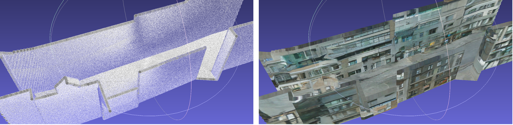
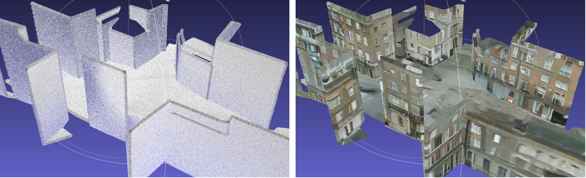
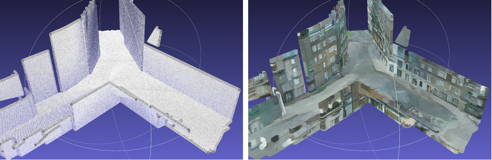
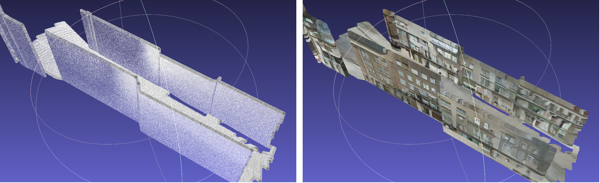
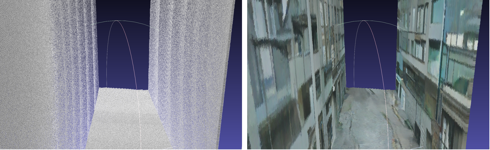

# [CVPR 2024 Highlight] Sat2Scene: 3D Urban Scene Generation from Satellite Images with Diffusion

[](https://arxiv.org/abs/2401.10786)
[](https://openaccess.thecvf.com/content/CVPR2024/html/Li_Sat2Scene_3D_Urban_Scene_Generation_from_Satellite_Images_with_Diffusion_CVPR_2024_paper.html)
[](https://www.youtube.com/watch?v=NqFy20zjFHU)

This is the official code of the CVPR 2024 paper Sat2Scene: 3D Urban Scene Generation from Satellite Images with Diffusion. For more details, please refer to our paper and [project page](https://shinkyo0513.github.io/Sat2Scene/).


## Environment requirement

For 3D generation part
* `PyTorch 2.0.0+cu117`
* `MinkowskiEngine 0.5.4` [Minkowski Engine](https://nvidia.github.io/MinkowskiEngine/overview.html)
* `ema_pytorch`

For rendering part
* Coming soon

## Dataset preparation

Please refer to this [page](https://github.com/lizuoyue/sat2scene/tree/main/holicity_dataset) for the dataset preparation.

## 3D sparse diffusion model

### Inference

The inference process can be run on NVIDIA TITAN RTX with 24GB memory. The trained model checkpoint can be downloaded [here](https://drive.google.com/file/d/1Ii4abHbRUtO6hrjc0JUWCuDARwBiaZ54/view?usp=drivesdk). Place the checkpoint file in the folder `checkpoint_folder`.

Exemplary point cloud files can be downloaded [here](https://drive.google.com/drive/folders/1ZBeuMITxBHB0-rbUUbz5dNoYRCSvJUdo?usp=sharing). Place the point cloud `.txt` file in the folder `point_cloud_files`. (__IMPORTANT__!) For customized point clouds, it is required that the unit of the coordinates is the __meter__ and the point density is __~400__ points per square meter sampled with [Poisson Disk](https://www.open3d.org/docs/0.7.0/python_api/open3d.geometry.sample_points_poisson_disk.html).

After running the below script, the result files will be saved in the folder `checkpoint_folder/result_files`.

```
CUDA_VISIBLE_DEVICES=0 python3 denoising_diffusion_pytorch/denoising_diffusion_minkowski.py \
  --dataset_folder point_cloud_files \
  --dataset_mode test \
  --work_folder checkpoint_folder \
  --sampling_steps 1000 \
  --use_ema \
  --num_sample 1 \
  --point_scale 15 \
  --ckpt 218 \
  --save_folder result_files
```

[MeshLab](https://www.meshlab.net/) can visualize the exemplary point clouds (left) and the textures produced by the 3D sparse diffusion model (right).







### Training

Instruction coming soon.

## Rendering
Training and inference code coming soon.

## BibTeX

```
@InProceedings{li2024sat2scene,
    author    = {Li, Zuoyue and Li, Zhenqiang and Cui, Zhaopeng and Pollefeys, Marc and Oswald, Martin R.},
    title     = {Sat2Scene: 3D Urban Scene Generation from Satellite Images with Diffusion},
    booktitle = {Proceedings of the IEEE/CVF Conference on Computer Vision and Pattern Recognition (CVPR)},
    month     = {June},
    year      = {2024},
    pages     = {7141-7150}
}
```
